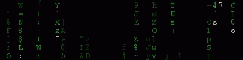

<svg
  fill="none"
  viewBox="0 0 800 400"
  width="800"
  height="400"
  xmlns="http://www.w3.org/2000/svg"
>
	<foreignObject width="100%" height="100%">
    

      
    
      
    
      

        

         
    
        

          
        

      

    

  </foreignObject>
</svg>
